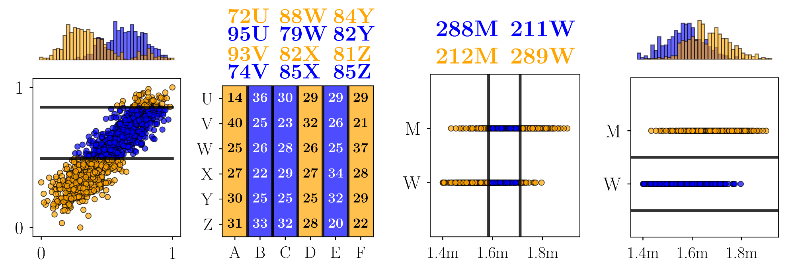

# MCDE - Extended

[](https://travis-ci.com/edouardfouche/MCDE-EXTENDED)
[](https://github.com/edouardfouche/MCDE/blob/master/LICENSE.md)




Welcome to the supplementary material for the paper:

-  Edouard Fouché, Alan Mazankiewicz, Florian Kalinke and Klemens Böhm. 2020. A framework for dependency estimation in heterogeneous data streams. Distributed and Parallel Databases, June 6, 2020. 30 pages. https://doi.org/10.1007/s10619-020-07295-x

This repository contains the original implementation of MCDE with estimators MWP, KSP and CSP, and the
information to reproduce the experiments in the paper. For this reason,
it is partially frozen at the time of publication.

This repository is released under the AGPLv3 license. Please see the [LICENSE.md](LICENSE.md) file. 

See also [MCDE](https://github.com/edouardfouche/MCDE) or [MCDE-experiments](https://github.com/edouardfouche/MCDE-experiments), as well as the following publication: 

-  Edouard Fouché & Klemens Böhm. 2019. Monte Carlo Dependency Estimation. In 31st International Conference on Scientific and Statistical Database Management (SSDBM ’19), July 23–25, 2019, Santa Cruz, CA, USA. ACM, New York, NY, USA, 12 pages. https://doi.org/10.1145/3335783.3335795


## Quick Start

### Build it and run it

**Requirements** : ([Oracle JDK 8](https://www.oracle.com/technetwork/java/javase/downloads/jdk8-downloads-2133151.html)
or [OpenJDK 8](http://openjdk.java.net/install/)) and [sbt](https://www.scala-sbt.org/1.0/docs/Setup.html)

The project is built with sbt (version 1.2.8). You can compile, package or run the project as follows:

```
sbt compile
sbt package 
sbt "run <arguments>"
```

You can also export a "fat" jar, including all dependencies and scala libraries using [`sbt-assembly`](https://github.com/sbt/sbt-assembly):

```
sbt assembly
```

This creates a jar in the folder `target/scala-2.12/` named `MCDE-EXTENDED-<version>.jar`, which can be run from java
(no sbt/scala installation required). The version of the package at the time of the experiments is 0.1.0.

Once you have built the jar, you can run it as follows: 

```
java -jar target/scala-2.12/MCDE-EXTENDED-0.1.0.jar <arguments>
```

You may find examples of usage of the estimators in `src/scala/io/githubedouardfouche/worksheets/user_guide.sc`

## Reproducing the experiments

In this section, we explain how to reproduce the experiments from our paper. 
The experiments create about 1.7G of data and require about 5 days on a server with 20 cores at 2.2 Ghz and 32GB RAM, 
using Java Open-JDK 8 and Scala 2.12.8. Results are saved in the folder `experiments` as `.csv` files, along with logs.

### Contrast

Evaluate the distribution of contrast values of MCDE (MWP, KSP, CSP and variants) against continuous, 
categorical and ordinal data. This experiment creates much data, but one may reduce the number of repetitions. 

```
sbt "run com.edouardfouche.experiments.Contrast"  # ~ 0.5 hour, 1.5GB data
```

### Power

Evaluate the statistical power  of MCDE (MWP, KSP, CSP and variants) against a panel of dependencies.

```
sbt "run com.edouardfouche.experiments.Power" # ~ 5 hours, 2MB data
```

### PowerDiscrete

Evaluate the statistical power  of MCDE (MWP, KSP, CSP and variants) against a panel of discrete linear dependencies.

```
sbt "run com.edouardfouche.experiments.PowerDiscrete" # ~ 2 hours, 17MB data
```

### PerformanceIndex 

Evaluate the performance (runtime) of the proposed index structure w.r.t. increasing window size. 

```
sbt "run com.edouardfouche.experiments.PerformanceIndex" # ~ 13 hours, 51MB data
```

### PerformanceContrast

Evaluate the performance (runtime) of contrast measures w.r.t. increasing window size. 
This experiment may take much time, but may be interrupted before ending without much impact on 
the quality of the results. 

```
sbt "run com.edouardfouche.experiments.PerformanceContrast" # ~ 3 days, 58MB data
```

### StreamMiner

Mine the contrast for numerous pairs for our use case (Bioliq). 

```
sbt "run com.edouardfouche.experiments.StreamMiner" # ~ 3 hours, 8MB data
```


### StreamEstimatorPerformance

Estimate the quality of contrast monitoring w.r.t. increasing number of iterations *M* and step size. 

```
sbt "run com.edouardfouche.experiments.StreamEstimatorPerformance" # ~ 21 hours, 42MB data
```

## Visualize the results

Then, you can use the Jupyter notebooks in folder `visualize` to reproduce 
the plots from the publication. By the time of the experiments, we use the following Python packages: 

```
# Name                    Version               
matplotlib                2.0.2             
numpy                     1.18.1              
pandas                    0.25.3     
seaborn                   0.9.0           
```

## Contributing

We welcome contributions to the repository and bug reports on GitHub.

For questions and comments, please contact `edouard.fouche@kit.edu`, or open an issue.

## Related Projects

- We propose a standalone, deployment-ready version of MCDE in this [repository](https://github.com/edouardfouche/MCDE).

- We developed a data generator for these experiments, which we released independently [here](https://github.com/edouardfouche/DataGenerator).


## Acknowledgements

- This work was supported by the DFG Research Training Group 2153: ‘Energy Status Data – Informatics Methods for its Collection, Analysis and Exploitation’ and the German Federal Ministry of Education and Research (BMBF) via Software Campus (01IS17042). We thank the pyrolysis team of the Bioliq process for providing the data for our real-world use case (see also https://www.bioliq.de).